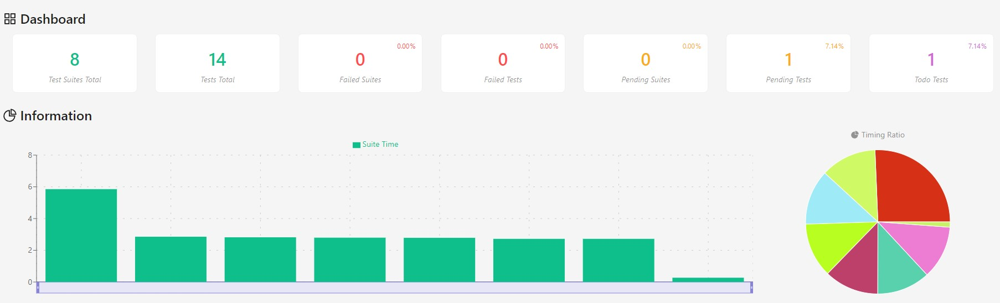

# Restful Booker API Automação de testes 🚀

Esse repositório contém a automação de testes de uma *API de gerenciamento de reservas* utilizando o framework [Jest](https://jestjs.io/)  com a biblioteca do [SuperTest](https://www.npmjs.com/package/supertest)

# Istalação 

```
$ git clone git@github.com:julianacarraroy/booker-api-test-automation.git
```
## Instalando as dependências 

```
# na pasta do projeto
$ cd booker-api-test-automation

# instalando as dependências do projeto
$ npm install

# na pasta da api
$ cd booker

# instalando as dependências
$ npm install

```

## Rodando os testes

```
# na pasta da api
$ npm run start

# executando os testes
$ npm run test

```

# Tecnologias utilizadas 

* Node.js - v18.14.2
* Jest - v29.6.1
* Supertest - v6.3.3

# Cobertura dos testes automatizados 
Testes automatizados escritos a partir das funcionalidades descritas na [documentação da API](https://restful-booker.herokuapp.com/apidoc/index.html), de modo a ampliar a cobertura dos testes.

# Reports 
```
# executando os testes com jest-html-reporters

$ npm run test --config='./reporter.config.js' 
```
* Relatório gerado ao fim da execução dos testes:
  



